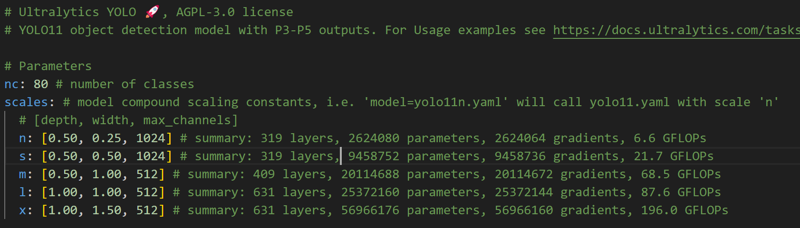

# Object Detection with Yolov11

# 설치방법

이 프로젝트에서는 서버 용량 제한으로 인해 가상환경을 사용하지 않습니다. 대신 다음 단계를 따라 필요한 파일을 다운로드하고 환경을 설정합니다

## git clone
```bash
git clone https://github.com/boostcampaitech7/level2-objectdetection-cv-02.git
```
clone을 하고 나면 자동적으로 baseline code 는 다운받아져 있을 것이다. 이후 data를 다운받으면 된다.


## 데이터 및 다운로드
```bash
wget https://aistages-api-public-prod.s3.amazonaws.com/app/Competitions/000325/data/data.tar.gz

```
## 압축 해제 및 정리
```bash
tar -zxvf data.tar.gz
rm  data.tar.gz
```

## ultralytics 세팅 마지막 준비
### train/images,labels 폴더 및 라벨링 데이터 만들기.
`dataset/labeling_make.ipynb` 를 켜서 작동시킵니다.
train/images 폴더에 image들이 옮겨져 있고
train/labels 폴더가 새로 생기며 .txt파일들이 그 안에 생기면 완성입니다.

### 필요한 requirements 다운
이후 필요한 requirements를 다운로드 받아야 합니다.
`pip install ultralytics wandb`  #wandb사용

`pip install opencv-python==4.8.0.74` <-이거는 Dict value error cv2dnn 이라고 뜰때 다운받아도 무방하나, 미리 설치하기를 추천한다.

### 터미널 경로 설정
터미널을 `/level2-objectdetection-cv-02/baseline/ultralytics ` 경로에서 열어야 합니다.

👉 즉, 위 경로에서 yolo 를 실행시킨다는 전제입니다.

## yolo 본격적으로 실행
### yolo config
`baseline/ultralytics` 폴더에 들어가면 `config.yaml`이 있습니다. 이를 이용하여 하이퍼파라미터 및 본인이 원하는 모델을 적용할 수 있습니다.

> 어떠한 파라미터들이 있는지 알고 싶다면은,`level2-objectdetection-cv-02/baseline/ultralytics/ultralytics/cfg/defalut.yaml`  를 열어보세요! 다양한 파라미터들이 있음을 알 수 있습니다

자세한 config 설명은 :https://docs.ultralytics.com/usage/cfg/

### CLI interface Usage
yolo TASK MODE ARGS

- TASK (optional) is one of [detect, segment, classify, pose, obb]

- MODE (required) is one of [train, val, predict, export, track, benchmark]

- ARGS (optional) are any number of custom 'arg=value' pairs like 'imgsz=320' that override defaults.

### yolo Train
`yolo train cfg=config.yaml` 

### yolo predict
`yolo predict cfg=config.yaml model='your_model' source='your_path' imgsz=320`
또는
`baseline/ultralytics/predict.py` 실행
 
### yolo test
-> `test.ipynb` 실행.

❗만약 dataset 경로를 못 찾는경우 
-> `yolo settings datasets_dir="../dataset"` 으로 바꾸고 다시 실행


### yolo special commands
- `yolo help`   # 어떻게 yolo 를 사용하는지 간단한 명령어 모음 나옴
- `yolo checks` # 본인이 yolo 를 사용할 수 있는 환경인지 나옴
- `yolo version` # 지금 사용하고 있는 yolo version 나옴
- `yolo settings` # 현재 yolo settings가 어떻게 되어 있는지 .setting.json에 있는 설정들 나옴
- `yolo cfg` # 본인이 하고 있는 설정들이 나온다.
- `yolo copy-cfg` # 현재 config설정들이랑 똑같은 것을 만든다.

### yolo tracking
`yolo track source="path/to/video"`

### yolo hub
위 프로젝트는 ultralytics에서 제공하는 hub를 통해 프로젝트의 진행상황을 모니터링 합니다. 

## yolov11 모델들의 다양한 구조에 대해서 궁금하다면?
`level2-objectdetection-cv-02/baseline/ultralytics/ultralytics/cfg/models/11/yolo11.yaml`<- 여기 yaml파일을 열어보면 됩니다.

 
위 이미지처럼 잘 나와있다..!

## wandb 사용방법
자세한 설명 : https://docs.ultralytics.com/integrations/weights-biases/
- wandb 설치
`pip install wandb`

- wandb 로그인 : https://wandb.ai/ 로 가서 새로운 project 를 만들고 본인의 api 키를 받아야 한다.
`wandb login` 
이렇게 하면 자동으로 wandb 를 쓰게 된다.

- 만약 wandb 를 쓰고 싶지 않다면,
`yolo settings wandb=false` 를 입력하면 된다. 
다시 쓰고 싶다면 
`yolo settings wandb=true` 

- 따로 폴더를 지정하고 싶다면 `yolo train cfg=config.yaml project=ultralytics name=wandb`

# ❗ TroubleShooting & Questions
## 중간에 실행을 멈추었음에도 GPU 가 계속 작동
① `sudo apt install nvtop`

`nvtop` 을 실행해보면 계속 실행중인 PID가 보일 것이다.
`kill [PID]` 입력하면 됩니다.
ex) kill 219642

② 두번째 방법으로는 `ps aux | grep python` 입력하면 yolo를 실행중인 .py 가 보일 것이다.여기 나오는 PID를 모두 삭제.

## 계속 경로를 찾을 수 없다고 나올때
① ultralytic의 settings.json
이때는 ultralytics 의 setting.json 을 잘못설정되었을 가능성이 높다.
`yolo settings` 입력후 `datasets_dir`의 경로가  제대로 입력되었는지 확인한다.
만약 고치고 싶다면 `yolo settings datasets_dir="your_path"` 입력

② data.yaml
data.yaml에 들어가서 본인의 data 경로를 입력해주어야함!

## labels 가 duplicate 되었다고 뜬다면?
이는 해당 .jpg의 라벨링이 두번 되었다는 뜻이므로, train/labels/해당.txt 에 가서 중복된 것을 지우고 저장하면 됩니다.

## 가상환경 만들고 돌리고 싶다면?
--> 해당 내용은 필자가 해보고, 완벽히 돌아가는 가상환경 구축예정

## train/images, train/labels 만들기 귀찮아요!
그럼 못 돌림. 본인이 class 안에 method까지 가서 고쳐야 하는데... 하지마세요!

## 다른 데이터 쓰고 싶은데용?
`baseline/ultralytics/ultralytics/cfg/datasets`에 들어가면 다양한 dataset yaml이 있습니다. 여기서 가져다가 쓰시면 됩니다.

ex) `config.yaml`에 들어가서 data: <- 이 부분 본인이 쓰고 싶은 yaml 파일 경로에 들어가기